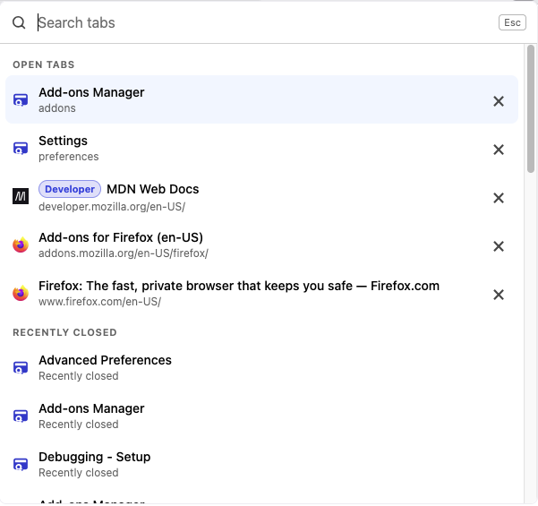
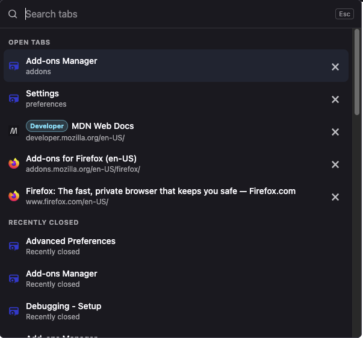

# Firefox Tab Search

Search, switch, close, and restore tabs across Firefox windows from one popup. Find open tabs by title, URL, or tab group name, or bring back recently closed tabs and windows.

Requires **Firefox 147 or later** on desktop.

> [!IMPORTANT]
> **Required shortcut setup: remove Firefox’s built-in Add-ons shortcut.**
>
> Firefox already uses **Ctrl+Shift+A** (**Command+Shift+A on macOS**) to open Add-ons. Clear that built-in assignment so the same shortcut can open Firefox Tab Search:
>
> 1. Type `about:keyboard` in Firefox’s address bar and press Enter.
> 2. Find the built-in **Add-ons** command assigned to `Ctrl+Shift+A` (`Command+Shift+A` on macOS).
> 3. Click **Clear** for that command.
>
> Keep **Firefox Tab Search’s own shortcut** assigned. If the popup still does not open, go to `about:addons` → gear menu → **Manage Extension Shortcuts** and check that Firefox Tab Search uses the shortcut above.
>
> See [Mozilla’s keyboard shortcut customization instructions](https://support.mozilla.org/en-US/kb/customize-keyboard-shortcuts-firefox) for details. You can still open Add-ons by entering `about:addons` in the address bar.

## Installation

The first Firefox Add-ons release is pending. An installation link will be added here after publication.

To try the extension before then, follow the [local development instructions](#development) to build and load it temporarily.

## Screenshots

The popup in light and dark mode, showing open tabs, tab group labels, and recently closed tabs.

| Light mode | Dark mode |
| --- | --- |
|  |  |

## Using Firefox Tab Search

Open the popup using the extension’s **Search tabs** button or **Ctrl+Shift+A** (**Command+Shift+A on macOS**) after completing the shortcut setup above. Start typing to search tab titles, URLs, and open tab group names.

Results are grouped into **Open Tabs** and **Recently Closed**. An empty search shows recent entries first within each group. Searches ignore case, support multiple words, and allow fuzzy matching in titles and group names. Named tab groups appear as color-coded labels beside open tab titles, and results refresh when groups change.

| Action | Control |
| --- | --- |
| Select a result | Up / Down arrow keys while the search field is focused, or hover over a result |
| Switch to an open tab | Enter or click the result; its Firefox window is brought forward |
| Restore a closed tab or window | Enter or click a result under Recently Closed |
| Close an open tab | Click the **×** button on its row |
| Dismiss the popup | Escape while the search field is focused |

**Selecting a closed window restores the whole window**, including its tabs. A closed window can match the title or URL of any tab it contained. Recently Closed shows up to 25 entries supplied by Firefox; it is not a full browsing-history search.

## Permissions and privacy

The extension uses three permissions:

- **`tabs`**: read tab titles and URLs so you can search your open tabs.
- **`sessions`**: list and restore recently closed tabs and windows.
- **`tabGroups`**: read tab group names and colors to display and search group labels.

Search runs locally in Firefox. The current implementation does not transmit your search queries or tab data to an external service and does not load remote favicon images.

## Development

The extension uses TypeScript, Vite, and Vitest. Install Firefox 147+ and **Node.js 24.21.0**, the version pinned in [`mise.toml`](mise.toml). If you use mise, run `mise install` from the repository directory to install the pinned toolchain.

Clone the repository and install dependencies:

```sh
git clone https://github.com/stanaka/firefox-ext-tab-search.git
cd firefox-ext-tab-search
npm ci
```

### Run in Firefox

Build the extension and launch Firefox with a temporary installation using web-ext:

```sh
npm run firefox
```

Apply the shortcut setup at the top of this README in the Firefox profile used for testing.

Alternatively, load the build into your existing Firefox profile:

1. Run `npm run build`.
2. Open `about:debugging#/runtime/this-firefox` in Firefox.
3. Click **Load Temporary Add-on**.
4. Select `dist/manifest.json` from this repository.

Temporary installations are removed when Firefox restarts. See [Mozilla’s temporary installation guide](https://extensionworkshop.com/documentation/develop/temporary-installation-in-firefox/) for details.

### Development commands

| Command | Purpose |
| --- | --- |
| `npm run dev` | Watch source files and rebuild into `dist/` |
| `npm run build` | Create a build in `dist/` |
| `npm run firefox` | Build and launch Firefox with the extension through web-ext |
| `npm test` | Run the Vitest tests |
| `npm run typecheck` | Check TypeScript types |
| `npm run lint` | Run ESLint |
| `npm run check` | Run type checking, ESLint, tests, the build, and web-ext validation |
| `npm run package` | Build and create an unsigned extension archive in `web-ext-artifacts/` |

For editing, keep `npm run dev` running in a separate terminal. It rebuilds files; it does not launch Firefox. If you loaded the extension manually, click **Reload** on its card in `about:debugging` after rebuilding. A running web-ext session watches the build directory and reloads the extension when those files change.

The package command overwrites an existing archive with the same name. It does not sign or publish the extension; a normal release installation requires Mozilla signing.

## License

[MIT](LICENSE) © 2026 Shinji Tanaka.
